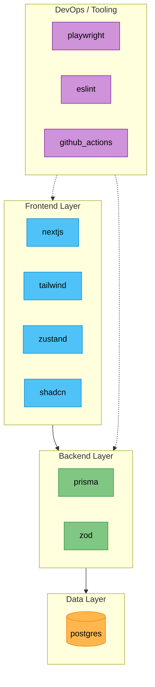

# Bill of Materials

> Generated: 2026-04-24 | Dependencies: 44 | Ecosystems: npm

## Tech Stack Overview

## License Summary

| License | Count | Percentage |
| ------- | ----- | ---------- |
| MIT | 34 | 77% |
| Apache-2.0 | 7 | 16% |
| ISC | 2 | 5% |
| BSD-3-Clause | 1 | 2% |

## Dependencies by Category

### Frontend (7 packages)

| Package | Version | License | Source |
| ------- | ------- | ------- | ------ |
| @tanstack/react-query | 5.97.0 | MIT | package.json |
| next | 16.2.3 | MIT | package.json |
| react | 19.2.4 | MIT | package.json |
| react-hook-form | 7.72.1 | MIT | package.json |
| sonner | 2.0.7 | MIT | package.json |
| tailwindcss | 4.2.2 | MIT | package.json |
| zustand | 5.0.12 | MIT | package.json |

### Backend (4 packages)

| Package | Version | License | Source |
| ------- | ------- | ------- | ------ |
| @prisma/client | 7.7.0 | Apache-2.0 | package.json |
| pg | 8.20.0 | MIT | package.json |
| prisma | 7.7.0 | Apache-2.0 | package.json |
| zod | 4.3.6 | MIT | package.json |

### Testing (1 packages)

| Package | Version | License | Source |
| ------- | ------- | ------- | ------ |
| @playwright/test | 1.59.1 | Apache-2.0 | package.json |

### Quality / Linting (2 packages)

| Package | Version | License | Source |
| ------- | ------- | ------- | ------ |
| eslint | 9.39.4 | MIT | package.json |
| eslint-config-next | 16.2.3 | MIT | package.json |

### Build Tools (1 packages)

| Package | Version | License | Source |
| ------- | ------- | ------- | ------ |
| @tailwindcss/postcss | 4.2.2 | MIT | package.json |

### Other (29 packages)

| Package | Version | License | Source |
| ------- | ------- | ------- | ------ |
| @base-ui/react | 1.3.0 | MIT | package.json |
| @hookform/resolvers | 5.2.2 | MIT | package.json |
| @prisma/adapter-pg | 7.7.0 | Apache-2.0 | package.json |
| @stomp/stompjs | 7.3.0 | Apache-2.0 | package.json |
| @types/bcryptjs | 2.4.6 | MIT | package.json |
| @types/node | 20.19.39 | MIT | package.json |
| @types/pg | 8.20.0 | MIT | package.json |
| @types/react | 19.2.14 | MIT | package.json |
| @types/react-dom | 19.2.3 | MIT | package.json |
| @upstash/ratelimit | 2.0.8 | MIT | package.json |
| @upstash/redis | 1.37.0 | MIT | package.json |
| bcryptjs | 3.0.3 | BSD-3-Clause | package.json |
| class-variance-authority | 0.7.1 | Apache-2.0 | package.json |
| clsx | 2.1.1 | MIT | package.json |
| framer-motion | 12.38.0 | MIT | package.json |
| jose | 6.2.2 | MIT | package.json |
| lucide-react | 1.8.0 | ISC | package.json |
| next-auth | 4.24.13 | ISC | package.json |
| next-intl | 4.9.0 | MIT | package.json |
| next-themes | 0.4.6 | MIT | package.json |
| react-day-picker | 9.14.0 | MIT | package.json |
| react-dom | 19.2.4 | MIT | package.json |
| recharts | 3.8.1 | MIT | package.json |
| resend | 6.12.2 | MIT | package.json |
| shadcn | 4.2.0 | MIT | package.json |
| tailwind-merge | 3.5.0 | MIT | package.json |
| tsx | 4.21.0 | MIT | package.json |
| tw-animate-css | 1.4.0 | MIT | package.json |
| typescript | 5.9.3 | Apache-2.0 | package.json |
