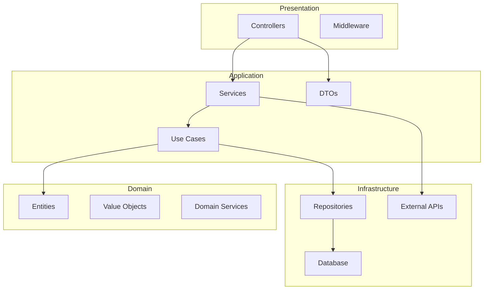
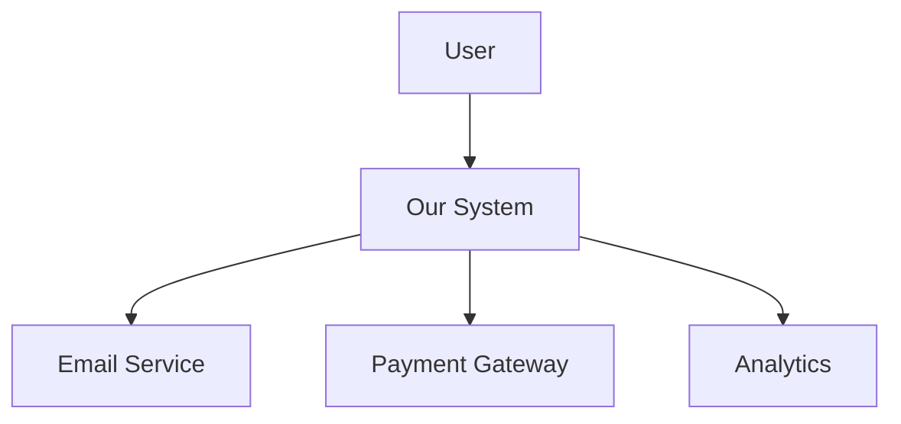
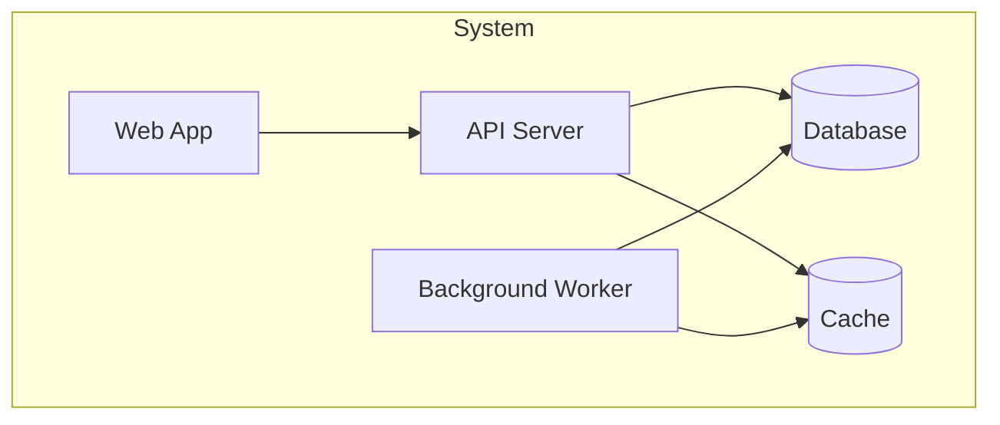

# Architecture Review Workflow

This workflow analyzes the project architecture and generates documentation.

## Step 1: Analyze Project Structure

Scan the codebase to understand:

- Directory structure
- Module organization
- Dependencies between modules
- Entry points

## Step 2: Identify Architecture Pattern

Determine the architecture style:

| Pattern                | Indicators                                        |
| ---------------------- | ------------------------------------------------- |
| **Layered**            | Controllers → Services → Repositories             |
| **Clean Architecture** | Domain, Application, Infrastructure, Presentation |
| **Hexagonal**          | Ports and Adapters                                |
| **Microservices**      | Multiple independent services                     |
| **Monolith**           | Single deployable unit                            |
| **Modular Monolith**   | Feature modules with clear boundaries             |

## Step 3: Generate Dependency Graph

Create a visual representation of module dependencies:



## Step 4: Analyze Dependencies

Check for:

### Circular Dependencies

```
⚠️ Circular dependency detected:
ModuleA → ModuleB → ModuleC → ModuleA
```

### Dependency Direction Violations

```
⚠️ Infrastructure depends on Application (should be reversed)
repositories/user.repository.ts imports services/user.service.ts
```

### Missing Abstractions

```
⚠️ Direct dependency on concrete implementation
user.service.ts directly imports prisma client
Recommendation: Create IUserRepository interface
```

## Step 5: Review Component Boundaries

For each module/feature:

### Cohesion Check

- Do all elements belong together?
- Is there a single, clear purpose?

### Coupling Check

- How many external dependencies?
- Are dependencies on abstractions or concretions?

### Encapsulation Check

- Is internal state properly hidden?
- Are there clear public interfaces?

## Step 6: Generate Architecture Documentation

Create `.windsurf/docs/ARCHITECTURE.md`:

```markdown
# Architecture Documentation

## Overview

[Brief description of the system]

## Architecture Style

[Layered / Clean Architecture / etc.]

## Project Structure

\`\`\`
src/
├── modules/ # Feature modules
│ ├── users/
│ ├── orders/
│ └── products/
├── common/ # Shared utilities
├── config/ # Configuration
└── main.ts # Entry point
\`\`\`

## Module Dependencies

### Users Module

- **Depends on:** Common, Config
- **Depended by:** Orders, Auth
- **External:** Database, Email Service

### Orders Module

- **Depends on:** Users, Products, Common
- **Depended by:** Reports
- **External:** Database, Payment Gateway

## Data Flow

1. Request → Controller
2. Controller → Service (validates, orchestrates)
3. Service → Repository (data access)
4. Repository → Database
5. Response ← Controller ← Service ← Repository

## Key Design Decisions

### Decision 1: [Title]

- **Context:** [Why was this decision needed?]
- **Decision:** [What was decided?]
- **Consequences:** [What are the trade-offs?]

### Decision 2: Event-Driven Communication

- **Context:** Need loose coupling between modules
- **Decision:** Use event emitter for cross-module communication
- **Consequences:**
  - ✅ Modules are decoupled
  - ❌ Harder to trace flow
  - ❌ Eventual consistency

## Deployment Architecture

\`\`\`mermaid
graph LR
Client[Client] --> LB[Load Balancer]
LB --> App1[App Server 1]
LB --> App2[App Server 2]
App1 --> DB[(Database)]
App2 --> DB
App1 --> Cache[(Redis)]
App2 --> Cache
\`\`\`

## Security Architecture

- Authentication: JWT tokens
- Authorization: Role-based (RBAC)
- Data encryption: TLS in transit, AES at rest
- Secrets: Environment variables / Vault
```

## Step 7: Identify Improvement Opportunities

### Technical Debt

| Issue               | Location       | Impact | Effort |
| ------------------- | -------------- | ------ | ------ |
| Missing interfaces  | Services       | Medium | Low    |
| Circular dependency | Users ↔ Orders | High   | Medium |
| God class           | OrderService   | High   | High   |

### Scalability Concerns

- Database queries not optimized for scale
- No caching layer
- Synchronous external API calls

### Maintainability Issues

- Inconsistent error handling
- Missing logging
- No feature flags

## Step 8: Generate Recommendations

```markdown
# Architecture Recommendations

## High Priority

### 1. Break Circular Dependencies

**Current:** Users → Orders → Users
**Solution:** Extract shared types to common module

### 2. Add Repository Interfaces

**Current:** Services directly use Prisma
**Solution:** Create IRepository interfaces for testability

## Medium Priority

### 3. Implement Caching Layer

**Benefit:** Reduce database load
**Approach:** Redis cache for frequently accessed data

### 4. Add Event Bus

**Benefit:** Decouple modules
**Approach:** Use EventEmitter2 or message queue

## Low Priority

### 5. Modularize Configuration

**Current:** Single config file
**Solution:** Per-module configuration
```

## Step 9: Create C4 Diagrams

### Context Diagram



### Container Diagram



## Step 10: Output Summary

```
Architecture Review Complete

Documentation generated:
- .windsurf/docs/ARCHITECTURE.md
- .windsurf/docs/diagrams/dependency-graph.mmd
- .windsurf/docs/diagrams/deployment.mmd
- .windsurf/docs/diagrams/c4-context.mmd

Findings:
- Architecture Pattern: Clean Architecture
- Modules: 8
- Circular Dependencies: 1 (Users ↔ Orders)
- Missing Abstractions: 3

Recommendations:
- High Priority: 2
- Medium Priority: 2
- Low Priority: 1

Technical Debt Score: 6/10 (Moderate)
```

## Gotchas

- **Circular dependencies are not always visible** -- static analysis tools detect import cycles, but runtime DI containers and event-based coupling create hidden circular dependencies. Trace actual call paths, not just import graphs.
- **Layered architecture does not mean clean architecture** -- having folders named `controllers/`, `services/`, `repositories/` is not sufficient. Verify that dependencies point inward (domain has zero external imports) and that layers do not skip levels.
- **Microservice boundaries drawn by technology instead of domain** -- splitting by "auth-service", "email-service" creates distributed monoliths. Boundaries should follow business domains (Bounded Contexts), not technical concerns.
- **C4 diagrams at the wrong zoom level** -- Context diagrams with 20+ external systems are unreadable. Limit Context to 5-7 actors; use Container diagrams for internal detail. Never put implementation details (class names) in a Context diagram.
- **Shared database across services defeats decoupling** -- two services reading/writing the same table creates implicit coupling. Even with microservices, a shared DB schema means any migration is a coordinated deployment.

## References

- `martinfowler.com/articles` — Architecture patterns: CQRS, Event Sourcing, Strangler Fig, Microservices, DDD
- `martinfowler.com/bliki/TechnicalDebt.html` — Technical debt definition and categorization
- `microservices.io/patterns` — Microservice architecture patterns catalog

## Step 9: Save to Dashboard

Persist the architecture review results for the dashboard:

1. Read `.windsurf/dashboard-data.json` (create with `{"projects":[],"runs":[],"globalStats":{}}` if missing)
2. Build a timestamp string: current ISO time with colons replaced by hyphens
3. Build a date string from the timestamp: `YYYY-MM-DD` (e.g. `2026-04-10`)
4. Create directory `.windsurf/dashboard/runs/architecture-review/[date]/[timestamp]/`
5. Write `findings.json` + `report.md` into that directory
6. Append a new entry to `runs[]` in `dashboard-data.json`:

```json
{
  "workflow": "architecture-review",
  "timestamp": "[ISO timestamp]",
  "score": "[100 - 15*critical - 8*high - 3*medium - 1*low, min 0]",
  "maxScore": 100,
  "verdict": "[Architecture pattern] - [Technical Debt Score]/10",
  "findings": { "critical": 0, "high": 0, "medium": 0, "low": 0 },
  "highlights": ["[good architecture patterns found]"],
  "issues": ["[architecture problems found]"],
  "summary": "[pattern] architecture with [N] findings, tech debt [X]/10",
  "reportPath": ".windsurf/dashboard/runs/architecture-review/[date]/[timestamp]/"
}
```

6. Write updated `dashboard-data.json` back to disk
