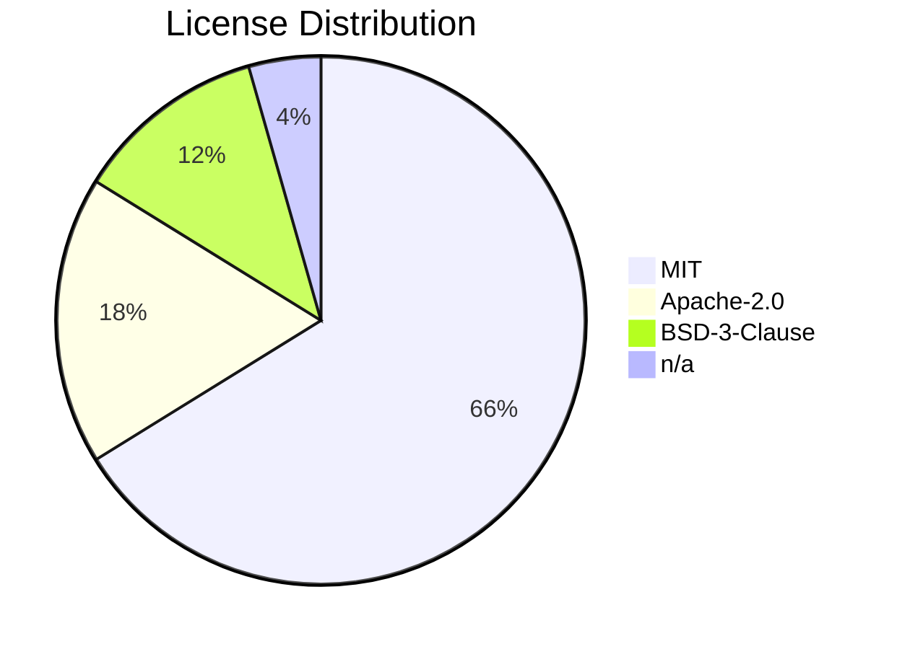

# Bill of Materials Workflow

This workflow scans the project for all dependencies across ecosystems, extracts versions and licenses, categorizes them by stack layer, and generates `.windsurf/docs/BOM.md` — a structured, visually rich document with Mermaid diagrams, license risk classification, collapsible dependency tables, and a stats dashboard.

## Prerequisites

- If the config server is running (port 3847), prefer using the `/generate-bom` endpoint directly:
  1. Run: `curl http://localhost:3847/generate-bom` or click **Analyze Project** in the UI
  2. The server generates `.windsurf/docs/BOM.md` automatically
  3. Skip all steps below

If the server is not available, proceed with the manual steps below.

## Step 1: Discover Dependency Files

Scan the project root and subdirectories for dependency manifests. Use `find_by_name` and `read_file` to locate:

| Ecosystem | Files to find                                 |
| --------- | --------------------------------------------- |
| npm       | `package.json`, `package-lock.json`           |
| Python    | `requirements.txt`, `pyproject.toml`          |
| Java      | `pom.xml`, `build.gradle`, `build.gradle.kts` |
| .NET      | `*.csproj`                                    |
| Go        | `go.mod`                                      |
| Rust      | `Cargo.toml`, `Cargo.lock`                    |
| PHP       | `composer.json`, `composer.lock`              |
| Ruby      | `Gemfile`, `Gemfile.lock`                     |
| Dart      | `pubspec.yaml`, `pubspec.lock`                |
| Elixir    | `mix.exs`                                     |
| Scala     | `build.sbt`                                   |
| Deno      | `deno.json`, `deno.jsonc`                     |

Also scan well-known subdirectories: `frontend/`, `backend/`, `client/`, `server/`, `web/`, `api/`, `app/`, `src/`, `packages/`, `apps/`, `libs/`, `services/`.

Read `.windsurf/tools/detection-maps.json` for stack categorization reference.

Also collect:

- Project name (from `package.json` `name`, `pyproject.toml` `[project] name`, `pom.xml` `<artifactId>`, `.csproj` filename, or directory name as fallback)
- Project version (from the same sources, or `n/a`)

## Step 2: Extract Versions

For each dependency file found:

1. **Prefer lock files** for exact versions (`package-lock.json`, `Cargo.lock`, `composer.lock`, `Gemfile.lock`, `pubspec.lock`)
2. **Fallback to manifest files** for version ranges/constraints
3. Extract: `name`, `version`, `source file path`, `dev dependency (yes/no)`

Track a separate count for:

- Production dependencies (non-dev)
- Development / build-time dependencies (dev)

## Step 3: Detect Licenses

Use a tiered approach:

1. **Local metadata (preferred):**
   - npm: Read `node_modules/<pkg>/package.json` -> `license` field
   - PHP: Read `vendor/<vendor>/<pkg>/composer.json` -> `license` field
   - Rust: Read `Cargo.toml` -> `license` field
   - Java: Read `pom.xml` -> `<licenses><license><name>` block
   - .NET: Read `.csproj` -> `<PackageLicenseExpression>`

2. **CLI tools (if installed):**
   - npm: `npm list --json` (check for license field)
   - PHP: `composer licenses --format=json`
   - Python: `pip-licenses --format=json` or `pip show <pkg>`

3. **Known license map (fallback):**
   Use well-known licenses for common packages (react=MIT, express=MIT, django=BSD-3-Clause, spring-boot=Apache-2.0, etc.). Mark unresolvable entries as `n/a`.

## Step 4: Classify License Risk

Assign a risk level to each license:

| Risk Level | Label               | Licenses                                                                         |
| ---------- | ------------------- | -------------------------------------------------------------------------------- |
| Low        | `[PERMISSIVE]`      | MIT, Apache-2.0, BSD-2-Clause, BSD-3-Clause, ISC, Unlicense, 0BSD, Zlib, CC0-1.0 |
| Medium     | `[WEAK COPYLEFT]`   | LGPL-2.0, LGPL-2.1, LGPL-3.0, MPL-2.0, CDDL-1.0, EPL-1.0, EPL-2.0                |
| High       | `[STRONG COPYLEFT]` | GPL-2.0, GPL-3.0, AGPL-3.0, EUPL-1.2                                             |
| Unknown    | `[UNKNOWN]`         | n/a, proprietary, custom, or unresolved                                          |

Compute an overall **Project License Risk**: Low (all permissive), Medium (at least one weak copyleft), High (at least one strong copyleft or unknown non-trivial dependency).

## Step 5: Categorize Dependencies

Assign each dependency to a category using `.windsurf/tools/detection-maps.json`:

- **Frontend** -- Framework, Styling, State Management, UI Library, Animation
- **Backend** -- Framework, ORM, Database Driver, Validation, Auth
- **Testing** -- Unit, E2E, Integration test tools, Mocking, Coverage
- **Quality / Linting** -- ESLint, Prettier, Biome, Stylelint, language-specific linters
- **Build Tools** -- Bundlers, transpilers, build systems, compilers
- **DevOps** -- Docker, CI/CD, deployment, monitoring tools
- **Other** -- Dependencies not matching any category

Within each category, separate into two groups:

- **Production** (non-dev)
- **Development** (dev/build-time)

## Step 6: Detect Tech Stack for Diagram

Read the project to identify the active tech stack:

- Frontend framework, styling, state management, UI library, bundler
- Backend framework, ORM, database, caching, message queue
- DevOps: testing, quality, CI/CD, deployment
- Architecture: monorepo, TypeScript, i18n

## Step 7: Generate `.windsurf/docs/BOM.md`

Create `.windsurf/docs/BOM.md` using the following full template. Fill every placeholder with real data.

---

```markdown
# Bill of Materials

> **Project:** `<project-name>` | **Version:** `<project-version>` | **Generated:** `<YYYY-MM-DD HH:MM UTC>`

---

## Table of Contents

1. [Quick Stats](#quick-stats)
2. [Tech Stack Overview](#tech-stack-overview)
3. [License Summary](#license-summary)
4. [License Risk Classification](#license-risk-classification)
5. [Dependencies by Category](#dependencies-by-category)
   - [Frontend](#frontend)
   - [Backend](#backend)
   - [Testing](#testing)
   - [Quality / Linting](#quality--linting)
   - [Build Tools](#build-tools)
   - [DevOps](#devops)
   - [Other](#other)
6. [Ecosystem Breakdown](#ecosystem-breakdown)

---

## Quick Stats

| Metric              | Value               |
| ------------------- | ------------------- |
| Total Dependencies  | X                   |
| Production          | X                   |
| Development / Build | X                   |
| Ecosystems          | npm, pip, ...       |
| Unique Licenses     | X                   |
| License Risk        | Low / Medium / High |

---

## Tech Stack Overview

(Mermaid diagram -- see Step 8)

---

## License Summary

(Mermaid pie chart -- see Step 9)

| License    | Count | Share | Risk         |
| ---------- | ----- | ----- | ------------ |
| MIT        | ...   | ...%  | [PERMISSIVE] |
| Apache-2.0 | ...   | ...%  | [PERMISSIVE] |
| ...        | ...   | ...%  | ...          |
| n/a        | ...   | ...%  | [UNKNOWN]    |

---

## License Risk Classification

| Risk Level             | Count | Packages          |
| ---------------------- | ----- | ----------------- |
| [PERMISSIVE] Low       | X     | pkg-a, pkg-b, ... |
| [WEAK COPYLEFT] Medium | X     | pkg-c, ...        |
| [STRONG COPYLEFT] High | X     | pkg-d, ...        |
| [UNKNOWN]              | X     | pkg-e, ...        |

> **Overall Project License Risk:** Low / Medium / High

---

## Dependencies by Category

### Frontend

> X production | X development | X total

<details>
<summary>Production dependencies (X)</summary>

| Package | Version | License | Risk         | Source       |
| ------- | ------- | ------- | ------------ | ------------ |
| ...     | ...     | ...     | [PERMISSIVE] | package.json |

</details>

<details>
<summary>Development dependencies (X)</summary>

| Package | Version | License | Risk         | Source       |
| ------- | ------- | ------- | ------------ | ------------ |
| ...     | ...     | ...     | [PERMISSIVE] | package.json |

</details>

---

### Backend

> X production | X development | X total

<details>
<summary>Production dependencies (X)</summary>

| Package | Version | License | Risk | Source |
| ------- | ------- | ------- | ---- | ------ |

</details>

<details>
<summary>Development dependencies (X)</summary>

| Package | Version | License | Risk | Source |
| ------- | ------- | ------- | ---- | ------ |

</details>

---

### Testing

> X development | X total

<details>
<summary>Development dependencies (X)</summary>

| Package | Version | License | Risk | Source |
| ------- | ------- | ------- | ---- | ------ |

</details>

---

### Quality / Linting

> X development | X total

<details>
<summary>Development dependencies (X)</summary>

| Package | Version | License | Risk | Source |
| ------- | ------- | ------- | ---- | ------ |

</details>

---

### Build Tools

> X development | X total

<details>
<summary>Development dependencies (X)</summary>

| Package | Version | License | Risk | Source |
| ------- | ------- | ------- | ---- | ------ |

</details>

---

### DevOps

> X total

<details>
<summary>All dependencies (X)</summary>

| Package | Version | License | Risk | Source |
| ------- | ------- | ------- | ---- | ------ |

</details>

---

### Other

> X total

<details>
<summary>All dependencies (X)</summary>

| Package | Version | License | Risk | Source |
| ------- | ------- | ------- | ---- | ------ |

</details>

---

## Ecosystem Breakdown

| Ecosystem | Manifest         | Dependencies |
| --------- | ---------------- | ------------ |
| npm       | package.json     | X            |
| Python    | requirements.txt | X            |
| ...       | ...              | ...          |
```

---

Omit any category section entirely if it has zero dependencies. Only render `<details>` blocks that contain at least one package.

## Step 8: Generate Mermaid Tech Stack Diagram

Inside the `## Tech Stack Overview` section, create a `graph TB` Mermaid diagram:

- **Subgraphs** for each detected layer: `Frontend Layer`, `Backend Layer`, `Data Layer`, `DevOps / Tooling`
- **Only include** layers and nodes that were actually detected in the project
- **Node labels** show the real detected technology names (e.g., React, NestJS, PostgreSQL)
- **Connections** between layers: `Frontend --> Backend --> Data`, `DevOps -.-> Frontend`, `DevOps -.-> Backend`
- **classDef styling** for visual distinction:
  - `frontend`: blue (`fill:#4FC3F7,stroke:#0288D1,color:#000`)
  - `backend`: green (`fill:#81C784,stroke:#388E3C,color:#000`)
  - `data`: orange (`fill:#FFB74D,stroke:#F57C00,color:#000`)
  - `devops`: purple (`fill:#CE93D8,stroke:#7B1FA2,color:#000`)
  - `quality`: gray (`fill:#B0BEC5,stroke:#546E7A,color:#000`)

Example structure (adapt nodes to actual stack):

```mermaid
graph TB
  subgraph Frontend Layer
    FW[React 18]
    ST[TailwindCSS]
    SM[Zustand]
    BU[Vite]
  end

  subgraph Backend Layer
    BE[NestJS]
    VA[class-validator]
    AU[Passport]
  end

  subgraph Data Layer
    DB[(PostgreSQL)]
    OR[TypeORM]
    CA[(Redis)]
  end

  subgraph DevOps / Tooling
    TE[Vitest]
    LI[ESLint]
    FO[Prettier]
    CI[GitHub Actions]
  end

  Frontend Layer --> Backend Layer
  Backend Layer --> Data Layer
  DevOps / Tooling -.-> Frontend Layer
  DevOps / Tooling -.-> Backend Layer

  classDef frontend fill:#4FC3F7,stroke:#0288D1,color:#000
  classDef backend fill:#81C784,stroke:#388E3C,color:#000
  classDef data fill:#FFB74D,stroke:#F57C00,color:#000
  classDef devops fill:#CE93D8,stroke:#7B1FA2,color:#000

  class FW,ST,SM,BU frontend
  class BE,VA,AU backend
  class DB,OR,CA data
  class TE,LI,FO,CI devops
```

## Step 9: Generate Mermaid License Pie Chart

Directly after the `## License Summary` heading and before the license table, insert a `pie` Mermaid diagram showing the license distribution across all dependencies:



Only include licenses with at least one package. Use the real counted values.

## Step 10: Output Summary

After generating `.windsurf/docs/BOM.md`, print a concise summary in chat:

```
BOM Generation Complete
------------------------
File:   .windsurf/docs/BOM.md

Total dependencies : X
  Production       : X
  Development      : X

Ecosystems         : npm, pip, ...
Categories         : Frontend (X), Backend (X), Testing (X), Quality (X), Build (X), DevOps (X), Other (X)

License distribution:
  MIT              : X  [PERMISSIVE]
  Apache-2.0       : X  [PERMISSIVE]
  ...
  n/a              : X  [UNKNOWN]

Overall License Risk: Low / Medium / High
```

## Error Handling

- If no dependency files are found: Create `.windsurf/docs/BOM.md` with the full template structure but populate all tables with a single row noting "No dependencies detected" and set all counts to 0
- If license detection fails for a package: Use `n/a`, classify as `[UNKNOWN]`, and count toward the Unknown risk group
- If `.windsurf/docs/` directory does not exist: Create it before writing
- If a category has zero packages: Omit that entire section from the output

## Step 11: Save to Dashboard

Persist the BOM results for the dashboard:

1. Read `.windsurf/dashboard-data.json` (create with `{"projects":[],"runs":[],"globalStats":{}}` if missing)
2. Build a timestamp string: current ISO time with colons replaced by hyphens
3. Build a date string from the timestamp: `YYYY-MM-DD` (e.g. `2026-04-10`)
4. Create directory `.windsurf/dashboard/runs/bom/[date]/[timestamp]/`
5. Write `findings.json` + `report.md` into that directory
6. Append a new entry to `runs[]` in `dashboard-data.json`:

```json
{
  "workflow": "bom",
  "timestamp": "[ISO timestamp]",
  "score": "[100 if all permissive, 80 if weak-copyleft present, 50 if strong-copyleft, 30 if unknown > 10%]",
  "maxScore": 100,
  "verdict": "License Risk: [Low / Medium / High]",
  "findings": {
    "critical": "[strong-copyleft count]",
    "high": "[unknown license count]",
    "medium": "[weak-copyleft count]",
    "low": 0
  },
  "highlights": ["[total deps], [ecosystems found], [most common license]"],
  "issues": ["[packages with problematic licenses]"],
  "summary": "[N] dependencies across [M] ecosystems, license risk: [level]",
  "reportPath": ".windsurf/dashboard/runs/bom/[date]/[timestamp]/"
}
```

6. Write updated `dashboard-data.json` back to disk
